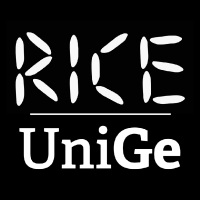

| |<h1><a href="https://rice.dibris.unige.it/">RICE (<strong>R</strong>obots and <strong>I</strong>ntelligent Systems for <strong>C</strong>itizens and the <strong>E</strong>nvironment)</a></h1>|
|:-:|:-|

RICE (Robots and Intelligent Systems for Citizens and the Environment) is a laboratory of the Department of Computer Science, Bioengineering, and Systems Engineering (DIBRIS) at the University of Genoa, founded in 2022.

RICE aims to develop intelligent robotic solutions closely aligned with the needs of society. Its objective is not only to create new technologies centered around humans and their needs but also to disseminate the findings of researchers exploring these aspects worldwide.

In this perspective, RICE focuses on two main areas of research: the development of “intelligent” humanoid social robots to assist and aid people, and the advancement of terrestrial and aerial autonomous robots for environmental monitoring and search and rescue operations after catastrophic events.

In the awareness that RICE, despite its humble nature, is the main food for human beings on Earth.

